# Vehicle Detection
This is the Udacity vehicle detection project. The goal of this project is to 
detect vehicles in an image and by extension in a video.

## Method

The steps of this project are the following:

* Perform a Histogram of Oriented Gradients (HOG) feature extraction on a labeled training set of images and train a classifier Linear SVM classifier
* Apply a color transform and append binned color features, as well as histograms of color, to the HOG feature vector. 
* Normalize features and randomize a selection for training and testing.
* Implement a sliding-window technique and use the trained classifier to search for vehicles in images.
* Run the pipeline on a video stream (start with the test_video.mp4 and later implement on full project_video.mp4) and create a heat map of recurring detections frame by frame to reject outliers and follow detected vehicles.
* Estimate a bounding box for vehicles detected.

## [Rubric](https://review.udacity.com/#!/rubrics/513/view) Points
###Here I will consider the rubric points individually and describe how I addressed each point in my implementation. 

---
###Writeup / README

####1. Provide a Writeup / README that includes all the rubric points and how you addressed each one.  You can submit your writeup as markdown or pdf.  [Here](https://github.com/udacity/CarND-Vehicle-Detection/blob/master/writeup_template.md) is a template writeup for this project you can use as a guide and a starting point.  

You're reading it!

###Histogram of Oriented Gradients (HOG)

####1. Explain how (and identify where in your code) you extracted HOG features from the training images.

Code for extracting HOG and other features is in **feature_extraction.py**. 

After much trial and error training the classifier, I found some variables that gave me the best results.

The image is converted to the YCrCb colorspace. I tried several color spaces including RGB, HSV and HSL, but settled on YCrCb because it detected the cars the best.

I generated the HOG for each color channel with 9 orientations, 8 pixels per cell, and 2 cells per block. 

For a 64x64 image, this returns 1764 features per channel or an array of shape (7, 7, 2, 2, 9) before flattening. That's a total of 5292 features.

I take the color histogram of each color channel and concatenate them together. I divide the histogram into 32 bins. Adding the three bins, this returns a total of 96 features.

Finally, I do a spatial binning after resizing the image to 32x32. Which really just flattens the image array. So for a 32x32 image with 3 channels, we get 3072 features.

There is a total of 8460 features per image.

The HOG images of car images are shown below:

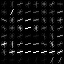
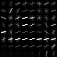
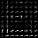
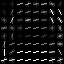
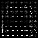

The HOG images of non car images are shown below:

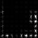
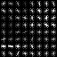
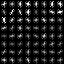
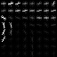
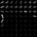

####2. Explain how you settled on your final choice of HOG parameters.

Explained above.

####3. Describe how (and identify where in your code) you trained a classifier using your selected HOG features (and color features if you used them).

The model is trained using a LinearSVC classifier. I also tried a DecisionTreeClassifier as well as other kernels on SVC,  but got better results and faster time using the LinearSVC. 
The classifier had an accuracy score of 0.994.

StandardScaler was used once all the features were extracted to scale the features down evenly with a zero mean.

This training step is meant to be done ahead of time. The fitted classifier and scaler are saved to finalized_model.pkl so it can later be loaded without needing to retrain every time a prediction is needed.

###Sliding Window Search

####1. Describe how (and identify where in your code) you implemented a sliding window search.  How did you decide what scales to search and how much to overlap windows?

The sliding window approach is very similar to what was covered in the course. 
The sliding_window_list method accepts a start (top-left x, y) and end (bottom-right x, y). You can also pass in the number of pixels per step and a scale. The scale determines how large of a window size you'd like for each sliding window. A scale of one, means the sliding window matches the size of the feature input which is 64x64. A scale of two means each sliding window will be 128x128. This scale is also returned with each sliding window output in order to compute HOG features later on.
In order to reduce the number of false positives, the sliding windows are only chosen on the bottom half of the image. Until flying cars exist, there's no reason to search the sky for cars. :) The sliding window is only searching the right half of the image. This was done more to speed up the processing, but also makes sense since vehicles on the left side of the screen are blocked by the highway median.

The following images show the sliding window approach:
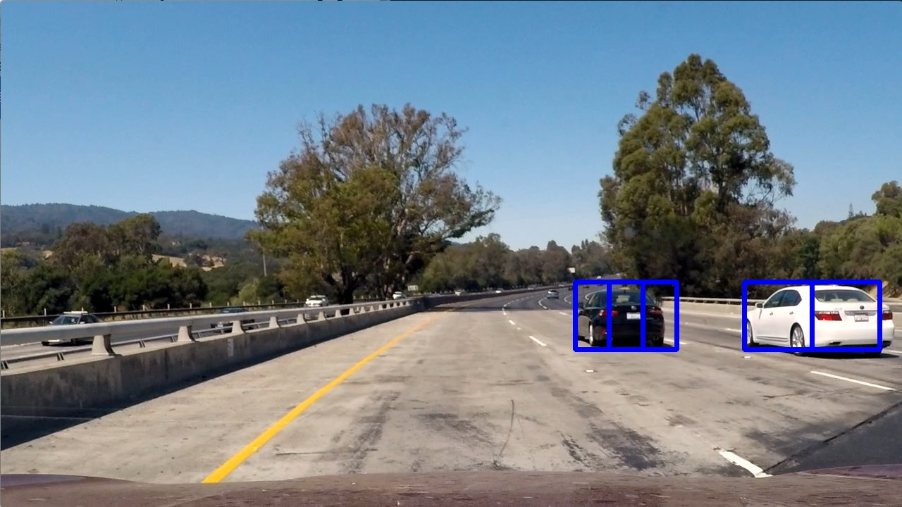

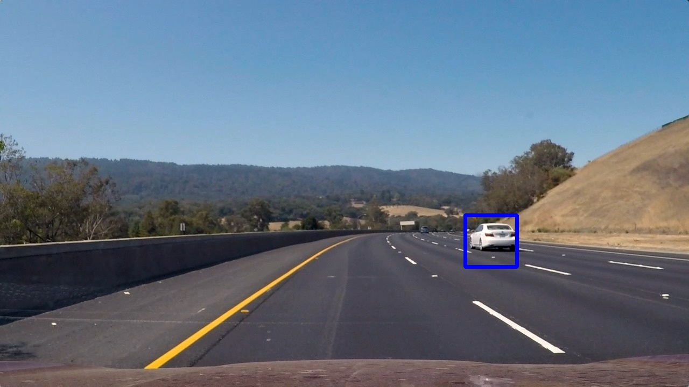
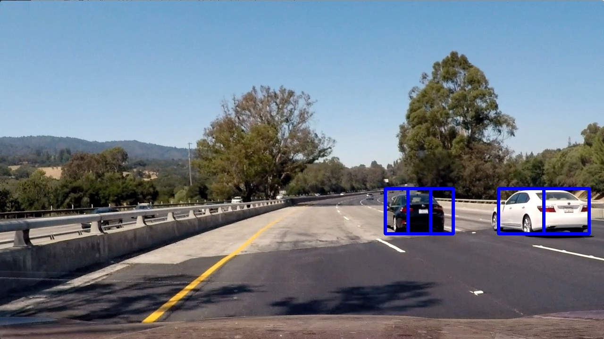
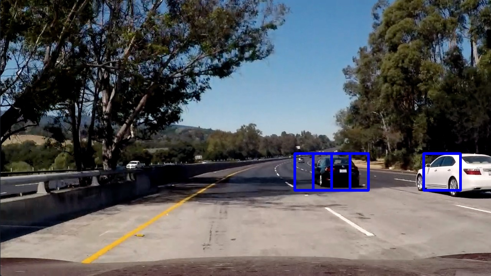

####2. Show some examples of test images to demonstrate how your pipeline is working.  What did you do to optimize the performance of your classifier?

Vehicle detection is done by iterating through each sliding window, calculating the feautes for each sliding window then running that through the classifier. If a car is predicted, the sliding window boundaries are saved. Each sliding window that was predicted to have a car combined and a heatmap of all those rectangles is created. Only rectangles that overlap at least once are considered actual cars. This is to reduce the number of false positives.
One detection optimization I made was to calculate the image HOG for the entire area of interest up front, rather than calculating the HOG for each sliding window. This gave me about a 3x speed improvement.
Below are the detected vehicles in the test images.

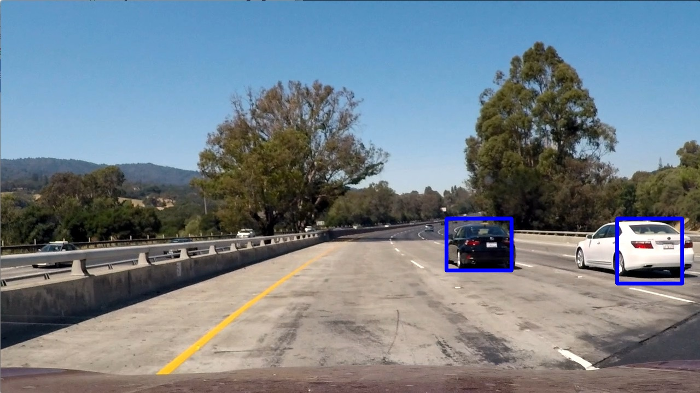

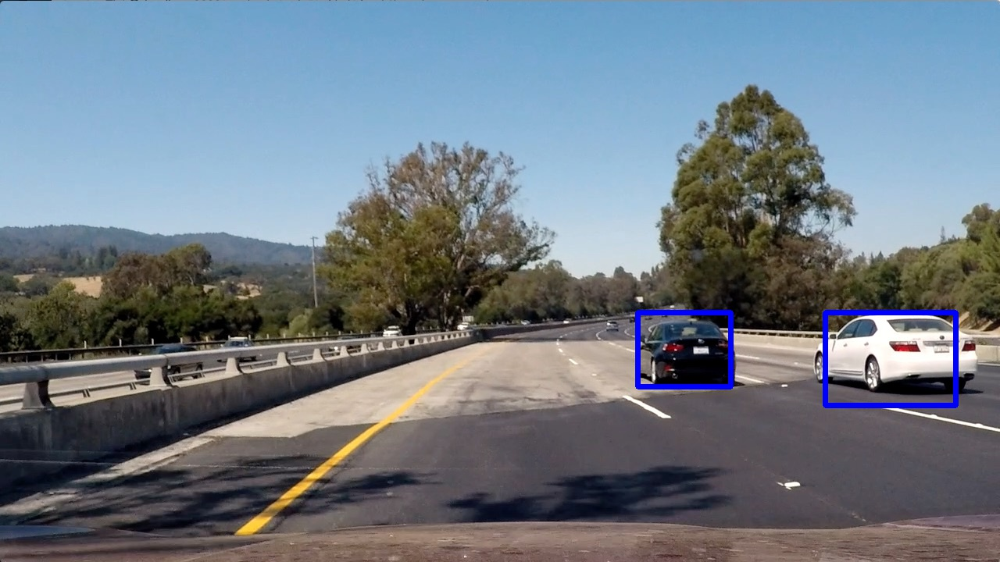

---

### Video Implementation

####1. Provide a link to your final video output.  Your pipeline should perform reasonably well on the entire project video (somewhat wobbly or unstable bounding boxes are ok as long as you are identifying the vehicles most of the time with minimal false positives.)
This vehicle detection method is run for each image in the project_video.mp4 file. Since we have more frames of reference, the heatmap for the past 3 frames are stored and the bounding boxes for the cars are detected from this history of heatmaps. This is to reduce the amount of jittering and jumping around of the detected vehicle boxes.
Here's a [link to my video result](output_project_video.mp4)

####2. Describe how (and identify where in your code) you implemented some kind of filter for false positives and some method for combining overlapping bounding boxes.

I recorded the positions of positive detections in each frame of the video.  From the positive detections I created a heatmap and then thresholded that map to identify vehicle positions.  I then used `scipy.ndimage.measurements.label()` to identify individual blobs in the heatmap.  I then assumed each blob corresponded to a vehicle.  I constructed bounding boxes to cover the area of each blob detected.  

Here's an example result showing the heatmap from a series of frames of video, the result of `scipy.ndimage.measurements.label()` and the bounding boxes then overlaid on the last frame of video:

The following images show the sliding window with heat map applied:
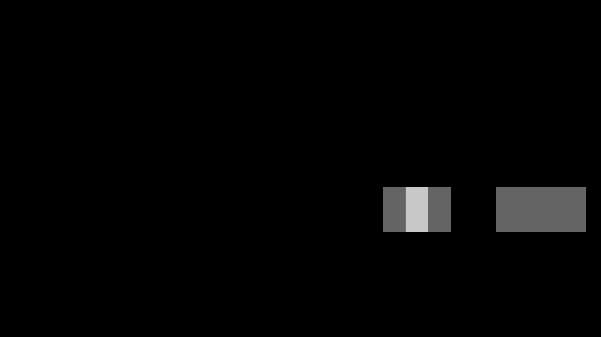
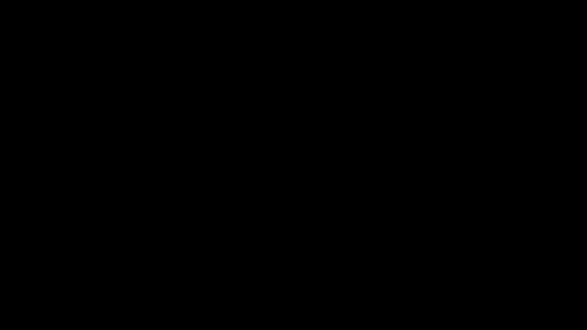
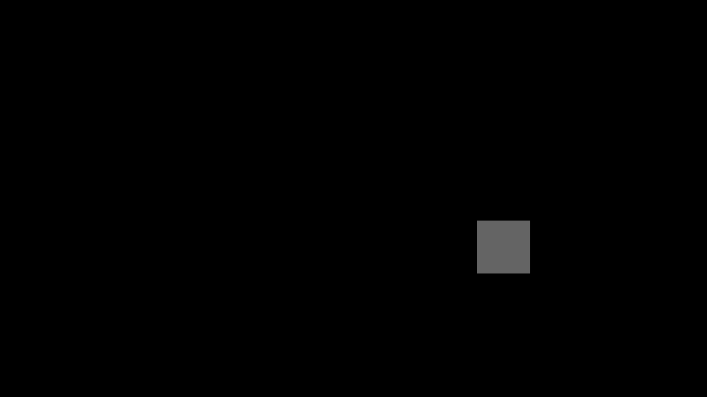

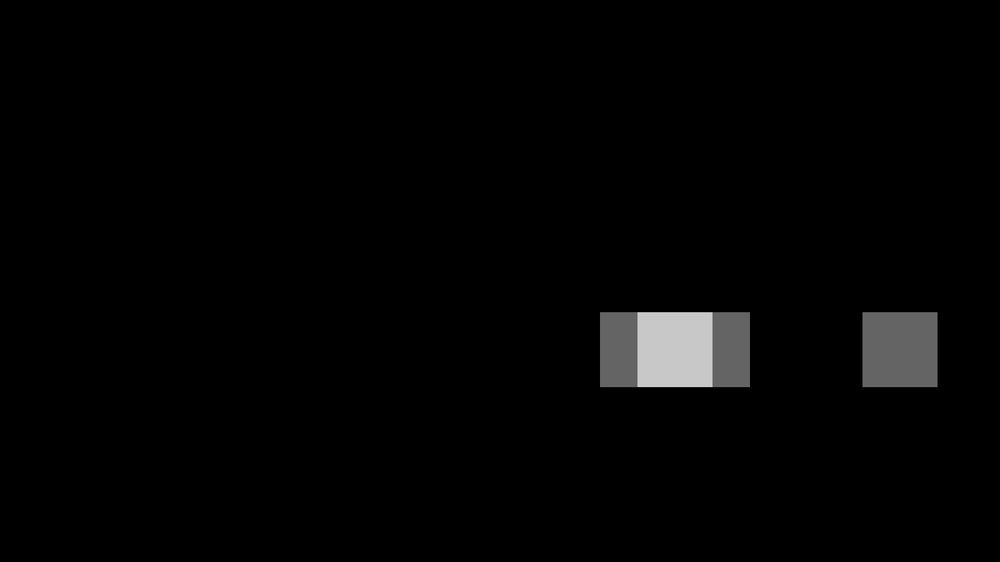

### Here is the output of `scipy.ndimage.measurements.label():

---

###Discussion

####1. Briefly discuss any problems / issues you faced in your implementation of this project.  Where will your pipeline likely fail?  What could you do to make it more robust?

More work can be done on smoothing out the detection boxes. The is still some visible jittering between frames. I am still seeing some false detections on the left side of the screen, this is something that could potentially fixed by changing sliding window paramters.
